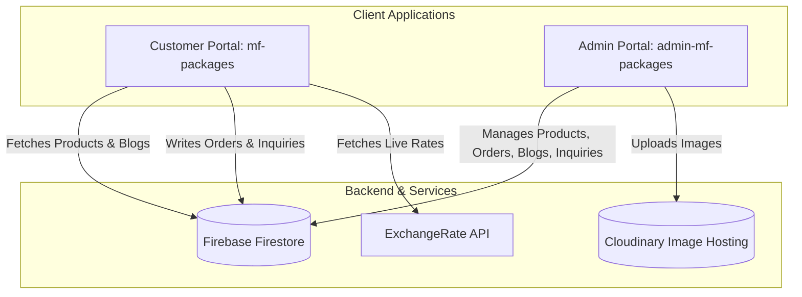

# MF Packages - Ecosystem Codebase Overview

Welcome! This document provides a comprehensive technical overview of the **MF Packages** ecosystem, which consists of two main Next.js applications sharing a single Firestore database:

1. **Customer-Facing E-commerce Store (`mf-packages`)**
2. **Administrative Portal (`admin-mf-packages`)**

This architecture enables a seamless, real-time workflow between customer interactions (browsing, inquiry submission, ordering) and store administration (order fulfillment, product management, content publishing).

---

## 🏗️ Ecosystem Architecture

---

## 🛠️ Technology Stack & Dependencies

### 🛒 Customer Portal ([mf-packages](file:///d:/Coding%20Projects/MF%20Packages/mf-packages))
* **Framework**: Next.js 16.1.1 (App Router)
* **State Management**: Redux Toolkit & React Redux
* **Session Persistence**: Redux Persist (local storage key: `mf-packages-cart`)
* **Styling**: Tailwind CSS v4 + custom transitions/animations
* **Slider/Carousel**: Swiper.js v12
* **Animations**: Framer Motion v12 & Lucide Icons

### 🔑 Admin Portal ([admin-mf-packages](file:///d:/Coding%20Projects/MF%20Packages/admin-mf-packages))
* **Framework**: Next.js 16.1.7 (App Router)
* **Authentication**: Firebase Authentication
* **State Management**: React Context (`AuthContext`)
* **Styling**: Tailwind CSS v4 & Lucide Icons
* **Charts/Analytics**: Recharts v3

---

## 📁 Ecosystem Directory Structures

### 1. Customer Portal ([mf-packages/](file:///d:/Coding%20Projects/MF%20Packages/mf-packages))
* **`app/`**: App router pages:
  * [`about/`](file:///d:/Coding%20Projects/MF%20Packages/mf-packages/app/about): Company mission, values, certifications, and crew details.
  * [`blogs/`](file:///d:/Coding%20Projects/MF%20Packages/mf-packages/app/blogs): Articles display and nested post details page (`blogs/[id]`).
  * [`checkout/`](file:///d:/Coding%20Projects/MF%20Packages/mf-packages/app/checkout): Delivery details form and bank transfer instructions.
  * [`contact/`](file:///d:/Coding%20Projects/MF%20Packages/mf-packages/app/contact): Multi-purpose inquiry and custom quotation forms.
  * [`shop/`](file:///d:/Coding%20Projects/MF%20Packages/mf-packages/app/shop): Nested shop pages featuring dynamic categories, variations, and detail modals.
  * [`globals.css`](file:///d:/Coding%20Projects/MF%20Packages/mf-packages/app/globals.css): Tailwind configuration, theme definitions, and scroll bars.
* **`component/`**: Reusable components:
  * [`cart/`](file:///d:/Coding%20Projects/MF%20Packages/mf-packages/component/cart): Slide-over drawer ([`CartDropdown.jsx`](file:///d:/Coding%20Projects/MF%20Packages/mf-packages/component/cart/CartDropdown.jsx)), header trigger, and Redux slice ([`cartSlice.js`](file:///d:/Coding%20Projects/MF%20Packages/mf-packages/component/cart/cartSlice.js)).
  * [`home/`](file:///d:/Coding%20Projects/MF%20Packages/mf-packages/component/home): Interactive sections ([`Hero.jsx`](file:///d:/Coding%20Projects/MF%20Packages/mf-packages/component/home/Hero.jsx), [`Sec0.jsx`](file:///d:/Coding%20Projects/MF%20Packages/mf-packages/component/home/Sec0.jsx) category carousels, [`Sec1-5.jsx`](file:///d:/Coding%20Projects/MF%20Packages/mf-packages/component/home/) showcases).
  * [`shop/`](file:///d:/Coding%20Projects/MF%20Packages/mf-packages/component/shop): `ProductCard`, pricing displays, specifications sheets.
* **`config/`**: Setup files:
  * [`redux/`](file:///d:/Coding%20Projects/MF%20Packages/mf-packages/config/redux): Combined store definition and currencySlice.
  * [`utils/`](file:///d:/Coding%20Projects/MF%20Packages/mf-packages/config/utils): Price calculators ([`pricing.js`](file:///d:/Coding%20Projects/MF%20Packages/mf-packages/config/utils/pricing.js)) and formatting helpers ([`currencyUtils.js`](file:///d:/Coding%20Projects/MF%20Packages/mf-packages/config/utils/currencyUtils.js)).
  * [`firebase.js`](file:///d:/Coding%20Projects/MF%20Packages/mf-packages/config/firebase.js): Client-side Firestore and App initialization.

### 2. Admin Portal ([admin-mf-packages/](file:///d:/Coding%20Projects/MF%20Packages/admin-mf-packages))
* **`app/`**: Portal pages:
  * [`login/`](file:///d:/Coding%20Projects/MF%20Packages/admin-mf-packages/app/login): Secured credential gate with friendly error handlers.
  * [`page.jsx`](file:///d:/Coding%20Projects/MF%20Packages/admin-mf-packages/app/page.jsx): Main dashboard container utilizing tabbed navigation.
  * [`layout.js`](file:///d:/Coding%20Projects/MF%20Packages/admin-mf-packages/app/layout.js) & [`globals.css`](file:///d:/Coding%20Projects/MF%20Packages/admin-mf-packages/app/globals.css): Core wrappers and theme setups.
* **`components/`**: Administrative features:
  * [`Overview.jsx`](file:///d:/Coding%20Projects/MF%20Packages/admin-mf-packages/components/Overview.jsx): Dashboard metrics and 7-day revenue charts.
  * [`ProductManagement.jsx`](file:///d:/Coding%20Projects/MF%20Packages/admin-mf-packages/components/ProductManagement.jsx): Product collection grid, filtering, and copy/duplicate action.
  * [`AddProductModal.jsx`](file:///d:/Coding%20Projects/MF%20Packages/admin-mf-packages/components/AddProductModal.jsx): Bulk specs editor, tiered pricing calculator, and image uploader.
  * [`ProductDetailsModal.jsx`](file:///d:/Coding%20Projects/MF%20Packages/admin-mf-packages/components/ProductDetailsModal.jsx): Read-only layout for review.
  * [`OrdersDashboard.jsx`](file:///d:/Coding%20Projects/MF%20Packages/admin-mf-packages/components/OrdersDashboard.jsx): Real-time order tracker with status changes and communication shortcuts (WhatsApp, Email).
  * [`Inquiries.jsx`](file:///d:/Coding%20Projects/MF%20Packages/admin-mf-packages/components/Inquiries.jsx): Contact submission manager (seen/unseen controls).
  * [`Blogs.jsx`](file:///d:/Coding%20Projects/MF%20Packages/admin-mf-packages/components/Blogs.jsx) & [`AddBlogModal.jsx`](file:///d:/Coding%20Projects/MF%20Packages/admin-mf-packages/components/AddBlogModal.jsx): Article CRUD operations.
  * [`Sidebar.jsx`](file:///d:/Coding%20Projects/MF%20Packages/admin-mf-packages/components/Sidebar.jsx) & [`Header.jsx`](file:///d:/Coding%20Projects/MF%20Packages/admin-mf-packages/components/Header.jsx): Navigational shell with live notifications.
  * [`ProtectedRoute.jsx`](file:///d:/Coding%20Projects/MF%20Packages/admin-mf-packages/components/ProtectedRoute.jsx): Session-verification wrapper.
* **`context/`**: Auth Context handling browser-local persistence ([`AuthContext.js`](file:///d:/Coding%20Projects/MF%20Packages/admin-mf-packages/context/AuthContext.js)).
* **`config/`**: Shared Firebase setup ([`firebase.js`](file:///d:/Coding%20Projects/MF%20Packages/admin-mf-packages/config/firebase.js)).

---

## ⚙️ Core Engines & Logic

### 1. Multi-Currency Engine
All products are priced in **PKR** as the single source of truth. Converting to other currencies uses a live pipeline:
* **API Sync**: On startup, `Navbar` calls ExchangeRate-API `PKR -> [USD, CNY, GBP, EUR]`.
* **Single Currency Lock**: Adding the first item locks the cart's session to that currency (`cartCurrency`). A currency mismatch banner is displayed, and checkout is disabled until the user switches back or clears the cart.
* **Format & Conversion**: Real-time conversion (`convertPrice`) and visual formatting (`formatPrice`) are used in all UI states.

### 2. Tiered Volume Pricing Logic
The app dynamically calculates unit pricing based on quantity:
* **Manual Override**: If enabled (`useTieredPricing`), the app queries Firestore for specific pricing tiers: 50, 100, 500, or 1000 pieces.
* **Fallback Logic**: If no manual tiers exist:
  * **50 pcs**: Price + Rs. 2.00 surcharge per piece.
  * **100 pcs**: Base Price.
  * **500 pcs**: Price - Rs. 2.00 discount per piece.
  * **1000 pcs**: Price - Rs. 3.00 discount per piece.

### 3. Image Hosting Pipeline
* **Cloudinary Direct Upload**: Base64/File images are sent to Cloudinary using an upload preset and cloud name. The generated `secure_url` is stored in Firestore.

---

## 🗄️ Firestore Database Schema

Here is the exact representation of data models inside Firebase:

### Collection: `products`
| Field Name | Type | Description |
| :--- | :--- | :--- |
| `name` | string | Product name / Collection heading |
| `category` | string | Product classification (e.g. Kraft paper standup pouch) |
| `size` | string | Physical dimensions (e.g. 10x15+3) |
| `price` | number | Base PKR price per piece |
| `printingPrice` | number | Surcharge for printed design requests |
| `inStock` | boolean | Toggle availability status |
| `stockAmount` | number | In-stock quantity count |
| `sku` | string | Unique serial reference identifier |
| `genDescription` | string | Rich product overview text |
| `mainImage` | string | Cloudinary URL for primary product cover |
| `genImage` | string | Cloudinary URL for dimensions illustration |
| `extraImages` | array | List of additional gallery slide URLs |
| `useTieredPricing` | boolean | Toggle switch for custom tier rates |
| `tieredPrices` | map | `{ "50": num, "100": num, "500": num, "1000": num }` |
| `technicalSpecs` | map | `{ colour, waterproof, style, heatSealable, tearNotch, closure, window }` |
| `materialStructure`| map | Dynamic layers `{ KraftPaper: 60, VMPET: 12, PE: 50 }` |
| `capacitySpecs` | map | Volume sizes per material `{ "Pink Salt": "500g", "Tea": "250g" }` |
| `showCapacity` | boolean | Toggle display of capacity table |

### Collection: `orders`
| Field Name | Type | Description |
| :--- | :--- | :--- |
| `orderId` | string | Serial number formatted as `MF-[Timestamp][Random]` |
| `customerDetails` | map | `{ fullName, phone, email, address }` |
| `items` | array | List of `{ id, name, size, quantity, basePricePKR, totalPriceConverted, mainImage }` |
| `paymentMethod` | string | Mode of transaction (exclusively `bank`) |
| `status` | string | Order lifecycle status (`Pending`, `accepted`) |
| `totalAmountConverted` | number | Final transaction value in selected currency |
| `totalAmountPKR` | number | Base reference value in PKR |
| `currencyUsed` | string | Checkout currency code |
| `exchangeRateAtTimeOfPurchase` | number | Rate multiplier applied at checkout |
| `createdAt` | serverTimestamp| Firestore creation timestamp |

### Collection: `contacts`
| Field Name | Type | Description |
| :--- | :--- | :--- |
| `name` | string | Customer full name |
| `email` | string | Contact address |
| `phone` | string | Customer phone number |
| `subject` | string | Inquiry title |
| `message` | string | Detailed message text |
| `isSeen` | boolean | Read status check for admin dashboard notifications |
| `createdAt` | serverTimestamp| Firestore creation timestamp |

### Collection: `blogs`
| Field Name | Type | Description |
| :--- | :--- | :--- |
| `id` | string | Auto-generated Firestore document ID |
| `title` | string | Article headline |
| `excerpt` | string | Summary text displayed on cards |
| `content` | string | Main article markdown content |
| `category` | string | Blog category |
| `date` | string | Human-readable date string |
| `readTime` | string | Approximate duration of article |
| `image` | string | Cloudinary banner URL |
| `iconName` | string | Lucide icon identifier (e.g. `Leaf`, `Zap`, `Shield`) |
| `color` | string | Tailwind background gradient string |

---

## 🎨 Styling, Colors & Aesthetic Design Tokens
* **Main Theme Colors**:
  * Deep Forest Teal: `#0b3a4c` (primary brand color for admin headers/sidebars, customer footers)
  * Intense Crimson Red: `#fa1a00` / `#E93E24` (accent badges, highlight text, and interactive buttons)
  * Off-White Background: `#F8FAFC` (page layouts)
* **Glassmorphic UI**: Combined backdrop blurs (`backdrop-blur-xl`) and transparent white borders (`border-white/20`) are used in navbars and dropdowns.
* **Typography**: Integrated Google Inter font (`font-sans`) optimized for maximum legibility on high-resolution displays.
